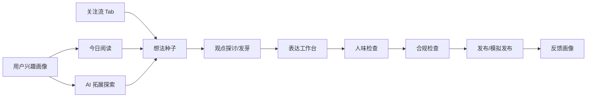
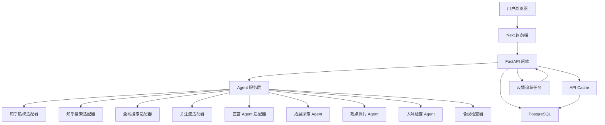

# 知见 Agent 产品与架构设计

## 1. 产品定位

知见 Agent 是面向知乎创作者的读写闭环工具。

它解决三个连续问题：

1. 看什么：基于用户兴趣画像，从热榜、搜索和 AI 探索方向中筛出值得阅读的内容；关注流作为独立视野入口。
2. 想什么：阅读后沉淀想法种子，让种子经过观点探讨、追问、反方观点和资料补强逐步发芽。
3. 写什么：在观点成熟后辅助组织表达，并在发布后追踪反馈，反哺创作风格。

核心原则：

- 不做一键水文生成。
- 不绕过平台审核。
- 不替用户伪造观点。
- AI 输出默认是建议、草稿和辅助材料，最终表达由用户确认。
- 发布前提供 AI 辅助创作声明、来源引用和风险提示。

一句话表达：

> 帮你从信息流里看见好内容，从阅读里长出真观点，再把观点说清楚。

## 2. 差异点

同类项目常见方向：

- 灵感激发、结构梳理、内容精加工。
- 多 AI 分身协作回答问题。
- 热点追踪后直接生成选题或文章。

知见 Agent 的差异：

1. 从阅读开始，不从写作开始。
2. 用想法种子连接阅读和创作。
3. 用观点发芽过程控制写作入口。
4. 用证据、反方观点和合规检查抑制低质 AI 内容。
5. 用发布后反馈形成长期创作画像。

## 3. MVP 演示闭环

第一版只做一个强闭环：

1. 用户维护兴趣画像。
2. 系统生成今日阅读卡片：兴趣精选 + 热点精选 + AI 拓展探索。
3. 关注流在独立 tab 中展示，用户可以从关注内容里沉淀种子。
4. 用户选择一个内容并记录想法种子。
5. Agent 陪用户进行观点探讨，让种子发芽。
6. 系统在观点成熟后输出观点卡、文章大纲和草稿。
7. 发布前进行人味检查和合规检查。
8. 展示文章反馈面板，模拟或接入真实反馈数据。

比赛演示路径：



## 4. 功能模块

### 4.1 今日阅读

今日阅读只处理平台公共内容和 AI 探索内容，不混入关注流。

输入：

- 用户兴趣画像。
- 阅读历史和已沉淀的观点种子。
- 知乎热榜。
- 知乎搜索结果。
- 全网搜索结果。

输出：

- 兴趣精选 3-5 条。
- 热榜高价值议题 3 条。
- AI 拓展探索 2 个方向，每个方向给 2-3 条内容。
- 每张卡片的推荐理由、主要争议、可写角度和沉淀入口。

拓展方向不是用户手动设置的固定属性，而是系统根据用户已有兴趣和阅读轨迹尝试探索。

示例：

```text
已有兴趣：AI Agent、后端工程、职业成长

今日拓展探索：
1. AI 编程工具对初级开发成长路径的影响
2. Agent 工程化中的质量评估和测试体系
```

筛选维度：

- 时效性。
- 讨论价值。
- 观点冲突度。
- 与用户兴趣的相关性。
- 对用户视野的拓展价值。
- 是否适合后续创作。

### 4.2 关注流 Tab

关注流是独立 tab，不放进今日阅读混排。

目标：

> 从用户关注的人和圈层动态里，筛出今天值得认真看的内容。

输入：

- 知乎关注流。
- 关注列表。
- 粉丝列表。
- 用户兴趣画像。

输出：

- 关注的人今天在讨论什么。
- 关注圈层里的高信息密度内容。
- 粉丝或潜在读者关心的主题。
- 适合转化成观点种子的内容。

筛选标准：

- 相关性。
- 信息密度。
- 争议度。
- 新鲜度。
- 可写性。
- 作者或内容权威度。

### 4.3 搜索式阅读

用户主动输入主题时，系统生成结构化阅读路径。

示例输入：

```text
AI Agent 质量评估
```

输出：

- 定义类内容。
- 框架类内容。
- 实践类内容。
- 争议类内容。
- 案例类内容。
- 可收藏材料。
- 可沉淀的观点种子建议。

搜索式阅读适合从“我想研究一个主题”进入，而今日阅读适合从“今天看什么”进入。

### 4.4 观点种子库

想法种子是用户读完内容后的原始判断，不要求完整。

它不是完整文章，也不是普通收藏，而是一个值得继续表达的想法单元。

字段：

- 来源内容：热榜、搜索、关注流、收藏或手动输入。
- 原始摘要。
- 内容关键观点。
- 用户一句话观点。
- 用户反应：认同、反对、有疑问、想补充、想写。
- 可写角度。
- 反方问题。
- 相关资料。
- 用户想写给谁看。
- 发芽状态：未发芽、探讨中、观点成形、已成稿、已发布、已反馈。

示例：

```text
观点种子：
AI 时代不是不需要刷题，而是不能再用背模板的方式刷题。

用户反应：
我觉得 AI 会削弱机械刷题的价值，但不会削弱问题抽象能力的价值。

可写角度：
LeetCode 的价值正在从代码熟练度训练，转向问题建模训练。
```

### 4.5 观点探讨

目标是把想法种子变成可以被表达的观点。

这里使用“发芽”作为产品心智：种子不是保存后立刻写，而是先被讨论、补充和修剪。

Agent 要做：

- 追问核心判断。
- 询问用户个人经验。
- 拆分前提、论据和结论。
- 生成反方观点。
- 查找知乎站内资料。
- 查找全网资料。
- 标出薄弱论证。
- 给出可写选题。
- 生成观点成熟度评分。

观点成熟度维度：

- 清晰度。
- 证据充分度。
- 反方处理。
- 表达对象明确度。
- 平台讨论价值。
- 个人经验密度。

观点探讨输出：

- 核心主张。
- 支撑理由。
- 反方质疑。
- 需要补充的个人经验。
- 适合发布的内容形态：回答、文章、想法、评论。
- 下一步建议：继续探讨、补资料、进入写作。

### 4.6 表达工作台

只有观点成熟后进入写作辅助。

输出：

- 核心观点。
- 文章标题候选。
- 开头候选。
- 结构大纲。
- 关键论据。
- 反方回应段落。
- 可发布草稿。

约束：

- 保留用户原始判断。
- 不编造事实。
- 引用资料必须能追溯来源。
- 标记哪些内容由 AI 辅助生成。

### 4.7 人味检查

人味检查用于避免草稿变成模板化 AI 文。

检查项：

- 是否有明确立场。
- 是否有用户个人经验。
- 是否有具体案例。
- 是否回应了反方观点。
- 是否存在空泛套话。
- 是否有知乎读者愿意讨论的问题。

输出：

- 缺少的个人材料。
- 建议补充的问题。
- 可替换的模板化表达。
- 最适合保留的用户原话。

### 4.8 合规检查

发布前必须经过该步骤。

检查项：

- 是否包含 AI 辅助创作。
- 是否需要 AI 辅助创作声明。
- 是否存在无来源事实断言。
- 是否涉及医疗、法律、金融、政治敏感、隐私或侵权风险。
- 是否存在诱导、广告或低质重复内容倾向。

输出：

- 风险等级。
- 需要人工确认的问题。
- 建议添加的 AI 创作声明。
- 来源引用列表。

### 4.9 反馈画像

第一版可以先做模拟数据，后续接入真实发布和互动数据。

追踪周期：

- 发布后 1 天。
- 发布后 3 天。
- 发布后 7 天。
- 发布后 14 天。
- 发布后 21 天。

文章画像：

- 阅读趋势。
- 点赞/收藏/评论趋势。
- 评论情绪。
- 争议点。
- 最能引发互动的观点。
- 下次写作建议。

用户画像：

- 擅长主题。
- 高互动表达方式。
- 常见论证短板。
- 适合继续深挖的选题。

## 5. 技术选型

推荐第一版采用：

- 前端：Next.js + TypeScript。
- UI：Tailwind CSS + shadcn/ui。
- 后端：FastAPI + Python。
- 数据库：PostgreSQL。
- ORM：SQLAlchemy 2.x + Alembic。
- 数据校验：Pydantic。
- 外部请求：httpx。
- 缓存：数据库持久化缓存为主，Redis 作为可选短期缓存。
- 异步任务：第一版用 FastAPI BackgroundTasks / APScheduler，后续需要再升级 Celery 或 RQ。
- 部署：Docker Compose 自部署。

理由：

- Python 更适合快速实现 Agent 编排、搜索结果处理、文本分析和后续模型调用。
- 前后端分离便于独立调试、部署和替换实现。
- FastAPI 的接口文档、类型校验和开发效率适合比赛节奏。
- PostgreSQL 比 SQLite 更适合部署后的多用户、缓存、反馈追踪和后续扩展。
- Docker Compose 可以在自己的服务器上一键启动，不依赖知乎官方资源。

备选方案：

- Spring Boot + React：更贴近 Java 经验，但比赛初期开发成本更高。
- Next.js API Routes：部署更简单，但 Agent 和官方接口适配会被前端工程绑住。

当前建议：

> 采用 Next.js + FastAPI 的前后端分离架构。第一版仍然保持单仓库管理，用 Docker Compose 部署多服务。

## 6. 系统架构



## 7. 代码模块建议

```text
frontend/
  app/
    page.tsx
    reading/page.tsx
    following/page.tsx
    search/page.tsx
    seeds/page.tsx
    seeds/[id]/page.tsx
    studio/page.tsx
    compliance/page.tsx
    feedback/page.tsx
  components/
    reading/
    following/
    search/
    seeds/
    studio/
    compliance/
    feedback/
    shared/
  lib/
    api-client.ts
    types.ts

backend/
  app/
    main.py
    core/
      config.py
      security.py
      logging.py
    api/
      routes/
        profile.py
        reading.py
        following.py
        search.py
        seeds.py
        germination.py
        draft.py
        human_check.py
        compliance.py
        feedback.py
    schemas/
      profile.py
      reading.py
      following.py
      search.py
      seed.py
      germination.py
      draft.py
      human_check.py
      compliance.py
      feedback.py
    models/
      user.py
      reading.py
      seed.py
      germination.py
      draft.py
      human_check.py
      compliance.py
      feedback.py
      api_cache.py
    services/
      agents/
        reading_agent.py
        expansion_agent.py
        germination_agent.py
        writing_agent.py
        human_check_agent.py
        compliance_agent.py
        feedback_agent.py
      adapters/
        zhihu_hot_list.py
        zhihu_search.py
        global_search.py
        following_feed.py
        direct_answer.py
      cache/
        api_cache.py
      jobs/
        feedback_tracker.py
    db/
      session.py
      base.py
    alembic/

docker-compose.yml
.env.example
```

## 8. 接口边界

前端只调用自有后端，不直接调用知乎或模型接口。

核心 API：

- `GET /api/profile/me`：读取用户兴趣画像。
- `PATCH /api/profile/me`：更新用户兴趣画像。
- `GET /api/reading/today`：生成或读取今日阅读卡片。
- `GET /api/following/feed`：读取关注流精选 tab。
- `GET /api/search/reading-path`：基于主题生成搜索式阅读路径。
- `POST /api/seeds`：创建想法种子。
- `GET /api/seeds`：读取观点种子库。
- `POST /api/seeds/{id}/germination`：启动观点探讨，让种子发芽。
- `POST /api/germination/{id}/answers`：提交追问回答。
- `POST /api/drafts`：生成大纲和草稿。
- `POST /api/human-check`：检查草稿是否缺少个人经验、明确立场和具体案例。
- `POST /api/compliance/check`：生成合规检查报告。
- `POST /api/publish/mock`：模拟发布或后续接入圈子发布。
- `GET /api/feedback/{draft_id}`：读取反馈画像。

接口设计原则：

- 前端永远接收结构化 JSON。
- 后端负责把官方接口返回转换成内部统一结构。
- 每个 Agent 输出都保留 `sources` 和 `ai_contribution_log`。
- 所有外部接口调用都先查缓存，再决定是否 live 请求。

## 9. 核心数据模型

### UserProfile

- id
- name
- interests
- preferredTopics
- avoidedTopics
- writingGoals
- readingHistorySummary
- seedHistorySummary
- createdAt
- updatedAt

### ReadingCard

- id
- sourceType: hot_list | zhihu_search | global_search | ai_expansion
- title
- summary
- url
- author
- publishedAt
- heatScore
- relevanceScore
- authorityLevel
- reason
- majorDebates
- writeAngles
- expansionDirection
- tags
- cachedRaw
- createdAt

### FollowingFeedItem

- id
- sourceType: following
- title
- summary
- url
- author
- authorAuthorityLevel
- publishedAt
- relevanceScore
- informationDensityScore
- discussionPotentialScore
- reason
- writeAngles
- cachedRaw
- createdAt

### IdeaSeed

- id
- userId
- sourceType: reading_card | following_feed | search_path | favorite | manual
- sourceItemId
- sourceTitle
- sourceSummary
- sourceKeyClaims
- rawThought
- userReaction: agree | disagree | question | supplement | want_to_write
- stance
- writeAngles
- counterQuestions
- relatedSources
- targetAudience
- germinationStatus: dormant | discussing | formed | drafted | published | feedback_collected
- writingStatus: not_started | outlining | drafting | polishing | published
- createdAt
- updatedAt

### GerminationSession

- id
- seedId
- questions
- answers
- coreClaim
- assumptions
- evidences
- counterArguments
- weakPoints
- personalExperiencePrompts
- suggestedContentForms
- maturityScore
- createdAt

### Draft

- id
- germinationSessionId
- titleCandidates
- outline
- argumentBlueprint
- paragraphCards
- draftContent
- humanCheckReportId
- aiContributionLog
- sourceList
- createdAt
- updatedAt

### HumanCheckReport

- id
- draftId
- hasClearStance
- hasPersonalExperience
- hasConcreteCases
- hasCounterArgumentResponse
- templateExpressionWarnings
- suggestedQuestions
- suggestedRewrites
- createdAt

### ComplianceReport

- id
- draftId
- riskLevel
- aiDeclarationRequired
- suggestedDeclaration
- issues
- sourceWarnings
- createdAt

### FeedbackSnapshot

- id
- draftId
- dayOffset
- views
- likes
- favorites
- comments
- commentSummary
- insight
- createdAt

## 10. 官方接口适配策略

所有官方接口都通过 adapter 调用，不在页面或业务逻辑里直接请求。

原因：

- 方便切换 mock / real。
- 方便做缓存。
- 方便统一处理额度限制。
- 方便比赛前接入真实 token。

接口状态分三层：

1. mock：开发期用本地假数据。
2. cached：有真实返回后优先读缓存。
3. live：比赛现场按需调用官方接口。

## 11. 自部署方案

知乎官方不提供资源，所以系统必须能独立部署。

第一版部署目标：

- 一台自有云服务器或本地服务器。
- Docker Compose 启动全部服务。
- 前端、后端、数据库分容器运行。
- 通过 `.env` 配置知乎接口 token、模型接口 key 和运行模式。

推荐服务：

```text
services:
  frontend: Next.js Web
  backend: FastAPI API
  postgres: PostgreSQL
  redis: optional cache / queue
  reverse-proxy: optional Nginx or Caddy
```

部署模式：

1. 本地开发：`frontend` + `backend` + `postgres`，默认使用 mock provider。
2. 演示部署：服务器 Docker Compose，开放前端访问地址，后端只给前端调用。
3. 比赛现场：切换为 cached/live provider，控制真实接口调用次数。

关键环境变量：

- `APP_ENV`
- `FRONTEND_BASE_URL`
- `BACKEND_BASE_URL`
- `DATABASE_URL`
- `REDIS_URL`
- `ZHIHU_API_BASE_URL`
- `ZHIHU_ACCESS_TOKEN`
- `DIRECT_ANSWER_API_BASE_URL`
- `DIRECT_ANSWER_API_KEY`
- `PROVIDER_MODE`: mock | cached | live

部署约束：

- 官方接口额度有限，默认不开 live 模式。
- 真实 token 只放后端环境变量，不进前端。
- 发布动作默认需要人工确认。
- 反馈追踪任务要有频率限制，避免反复请求。
- 演示环境必须准备固定 mock 数据，防止现场接口不可用。

## 12. 开发顺序

第一阶段：可演示原型

1. 创建 `frontend` 和 `backend` 目录。
2. 搭建 FastAPI 基础服务、健康检查和 OpenAPI 文档。
3. 搭建 Next.js 基础页面、导航和 API client。
4. 搭建 Docker Compose，本地一键启动。
5. 实现用户兴趣画像 mock。
6. 用 mock 数据跑通今日阅读卡片：兴趣精选、热点精选、AI 拓展探索。
7. 实现关注流独立 tab。
8. 实现搜索式阅读路径。
9. 实现想法种子创建和种子库。
10. 实现观点探讨和成熟度评分的 mock Agent。
11. 实现写作工作台。
12. 实现人味检查页。
13. 实现合规检查页。
14. 实现反馈画像页。

第二阶段：接入真实能力

1. 接入热榜。
2. 接入知乎搜索。
3. 接入全网搜索。
4. 接入直答 Agent。
5. 接入关注流。
6. 接入圈子发布和评论反馈。

第三阶段：比赛调优

1. 优化演示案例。
2. 强化合规叙事。
3. 优化 UI 视觉和动效。
4. 增加刘看山角色引导。
5. 准备答辩材料。

## 13. 你和 Codex 的协作方式

你负责：

- 产品判断。
- 技术方案取舍。
- 官方接口沟通。
- 关键演示案例设计。
- 比赛答辩叙事。
- 部署资源准备。

Codex 负责：

- 项目脚手架。
- 前端页面。
- FastAPI 后端。
- 数据模型。
- Agent 工作流实现。
- mock 数据和真实接口适配。
- Docker Compose 部署配置。
- 本地运行、测试和调优。

协作原则：

- 每次只推进一个可验证闭环。
- 先 mock 跑通，再接真实接口。
- 先保证演示体验，再补工程完整性。
- 所有外部接口都必须缓存。
- 所有 AI 输出都必须保留来源和参与记录。
