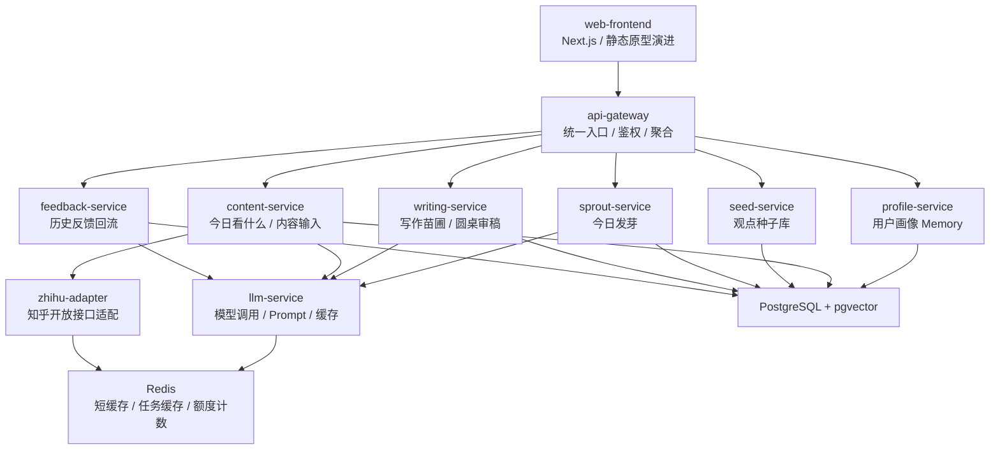
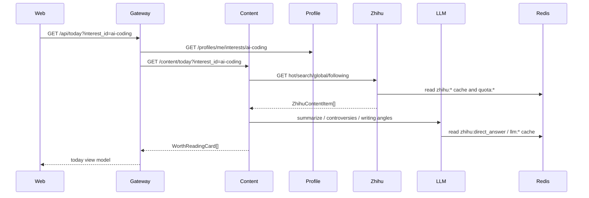
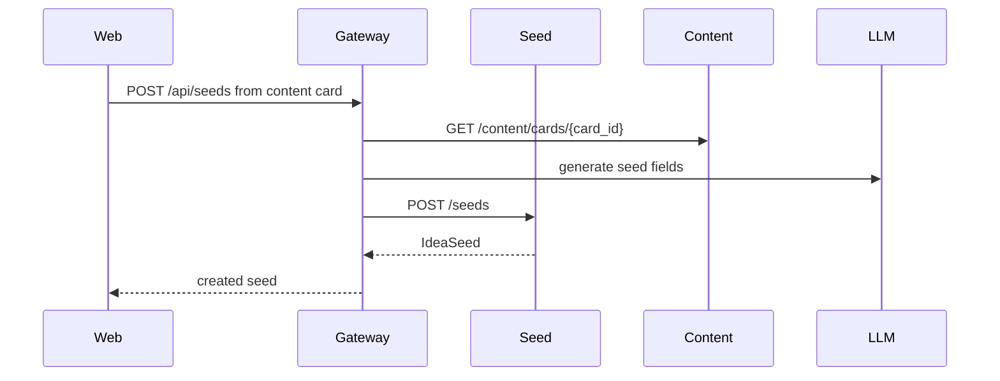
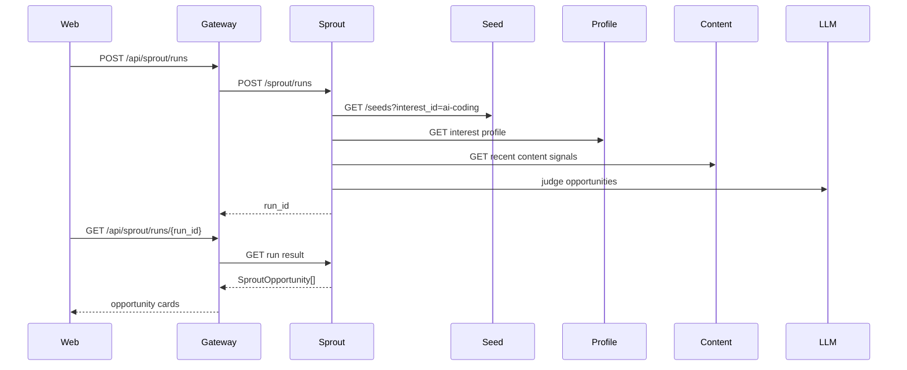
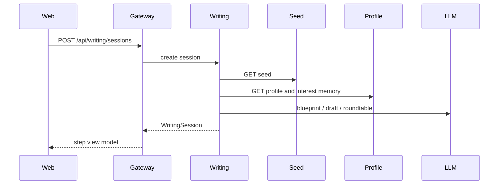

# 看山小苗圃-服务拆分与开发协作

## 1. 设计目标

这个项目只有一个主开发者，但会借助多个 AI coding 工具并行完成开发。

因此架构目标不是追求完整微服务治理，而是：

1. 服务边界清楚，方便把简单任务交给其他模型。
2. 核心链路可控，复杂业务由 Codex 重点把关。
3. 每个服务都能 mock 运行，避免阻塞联调。
4. 本地和演示环境可以用 Docker Compose 一键启动。
5. 后续如果时间紧，可以把服务合并成模块化单体，不推翻代码结构。

推荐方式：

> 服务化单仓库：代码按服务拆分，接口按微服务设计，部署用 Docker Compose；MVP 阶段允许先用 mock 和轻量实现跑通闭环。

接口字段、Redis key、知乎 API 映射和端到端数据流以 `docs/看山小苗圃-接口功能与数据流文档.md` 为准。本文档只描述服务边界和协作方式。

## 2. 总体架构



## 3. P0 服务拆分

### 3.1 web-frontend

职责：

- 页面展示和用户交互。
- 登录 / 演示模式入口。
- 个人画像展示。
- 今日看什么。
- 种子库。
- 今日发芽。
- 写作苗圃 8 步流程。
- 历史反馈 mock 页面。

技术：

- Next.js + TypeScript。
- Tailwind 或普通 CSS 均可。
- P0 可以先从 `kanshan_nursery_prototype.html` 迁移，不追求复杂组件库。

复杂度：低到中。

适合交给其他模型：

- 页面静态布局。
- 表单组件。
- API client 封装。
- mock 数据展示。

Codex 重点把关：

- 主流程是否符合产品文档。
- API contract 是否匹配后端。
- 演示路径是否顺。

### 3.2 api-gateway

职责：

- 前端唯一调用入口。
- 简单鉴权和演示用户注入。
- 聚合多个后端服务响应。
- 统一错误格式。
- 统一 request id / trace id。

技术：

- FastAPI。
- httpx 调内部服务。

复杂度：中。

适合交给其他模型：

- 健康检查。
- 路由代理。
- 错误响应格式。

Codex 重点把关：

- 跨服务接口契约。
- 前端需要的聚合接口。

### 3.3 profile-service

职责：

- 用户与演示账号。
- 首次画像采集。
- 全局画像 Memory。
- 兴趣分类画像。
- 写作风格问卷。
- Memory 维护：展示、编辑、版本记录、反馈回流确认。

服务边界决策：

> P0 阶段不单独拆 `memory-service`，Memory 作为 `profile-service` 内的独立子模块实现。代码目录、接口和数据表保持独立，后续如果 Memory 逻辑变复杂，可以平滑拆出独立服务。

核心数据：

- `users`
- `global_profiles`
- `interest_profiles`
- `memory_entries`
- `memory_versions`
- `memory_update_requests`

核心接口：

- `GET /profiles/me`
- `PUT /profiles/me`
- `GET /profiles/me/interests`
- `PUT /profiles/me/interests/{interest_id}`
- `POST /profiles/onboarding`
- `GET /memory/me`
- `PUT /memory/me/global`
- `GET /memory/me/interests/{interest_id}`
- `PUT /memory/me/interests/{interest_id}`
- `GET /memory/update-requests`
- `POST /memory/update-requests/{request_id}/apply`
- `POST /memory/update-requests/{request_id}/reject`

复杂度：低。

适合交给其他模型：

- CRUD。
- Pydantic schema。
- 数据库 migration。
- mock 数据。

Codex 重点把关：

- 画像结构是否支持“全局画像 + 兴趣分类画像”。
- Memory 如何注入写作、推荐和发芽流程。
- 历史反馈如何转成可确认的 Memory 更新，而不是自动覆盖用户画像。

未来拆分条件：

- Memory 需要独立检索、向量化和版本回放。
- 多个服务频繁读写 Memory，`profile-service` 变成瓶颈。
- 需要给用户提供完整 Memory 审计和回滚。
- 需要把 Memory 做成跨产品能力。

届时可拆为：

```text
memory-service
├── global memory
├── interest scoped memory
├── memory update requests
├── memory versions
└── memory retrieval / injection
```

### 3.4 content-service

职责：

- 今日看什么。
- 按兴趣小类生成值得看卡片。
- 关注流精选。
- 偶遇输入。
- 内容摘要、争议点、可写角度生成。
- 通过 `zhihu-adapter` 和 `llm-service` 读取 Redis 短缓存，避免重复调用知乎接口和直答 Agent。

核心数据：

- `content_cards`
- `serendipity_cards`
- `content_sources`

核心接口：

- `GET /content/today?interest_id=xxx`
- `GET /content/following?interest_id=xxx`
- `GET /content/serendipity?interest_id=xxx`
- `POST /content/cards/{card_id}/summarize`

复杂度：中。

适合交给其他模型：

- mock provider。
- 接口 DTO。
- Query Plan 和卡片评分的轻量实现。
- 关注流精选的简单排序。

Codex 重点把关：

- 卡片结构。
- 推荐理由生成逻辑。
- 偶遇输入不要变成随机推荐。

### 3.5 zhihu-adapter

职责：

- 封装知乎开放接口，不让业务服务直接依赖官方字段。
- 拆分 Community Client、OAuth Client、Data Platform Client。
- 统一鉴权、限流、Redis 短缓存、额度计数和字段归一化。
- 提供 mock / cached / live 三种模式。

核心接口：

- `GET /zhihu/hot-list`
- `GET /zhihu/zhihu-search`
- `GET /zhihu/global-search`
- `POST /zhihu/direct-answer`
- `GET /zhihu/following-feed`
- `GET /zhihu/ring-detail`
- `GET /zhihu/comments`
- `GET /zhihu/story-list`
- `GET /zhihu/story-detail`
- `POST /zhihu/publish/mock-or-live`

复杂度：低到中。

适合交给其他模型：

- API client skeleton。
- mock response。
- Redis cache key 设计。
- 限流计数。

Codex 重点把关：

- live 接口调用开关。
- Redis 缓存和额度保护。
- HMAC、OAuth Bearer、Data Platform Bearer 三类鉴权隔离。
- 不让 token 暴露到前端。

### 3.6 seed-service

职责：

- 观点种子创建、展示、编辑。
- 从值得看卡片生成种子。
- 合并相似种子。
- 种子状态流转。
- 种子向量索引。

核心数据：

- `idea_seeds`
- `seed_sources`
- `seed_vectors`

核心接口：

- `GET /seeds?interest_id=xxx`
- `POST /seeds`
- `GET /seeds/{seed_id}`
- `PUT /seeds/{seed_id}`
- `POST /seeds/{seed_id}/water`
- `POST /seeds/merge`

复杂度：中。

适合交给其他模型：

- CRUD。
- 状态枚举。
- 列表筛选。
- mock 种子数据。

Codex 重点把关：

- 种子字段设计。
- 状态机。
- 从内容卡片到种子的转换逻辑。

### 3.7 sprout-service

职责：

- 用户主动触发今日发芽。
- 读取历史种子、热点、搜索、关注流和用户画像。
- 计算 Activation Score。
- 生成发芽机会卡片。
- 缓存当天发芽结果。

核心数据：

- `sprout_runs`
- `sprout_opportunities`

核心接口：

- `POST /sprout/runs`
- `GET /sprout/runs/{run_id}`
- `GET /sprout/opportunities?interest_id=xxx`

复杂度：高。

不建议交给普通模型独立完成。

Codex 重点把关：

- 发芽计算流程。
- Activation Score。
- 任务状态。
- 成本控制。
- 失败降级。

其他模型可做：

- run 表 CRUD。
- 任务状态轮询。
- mock 发芽机会。

### 3.8 writing-service

职责：

- 写作苗圃 8 步流程。
- 核心观点确认。
- 文章类型选择。
- 论证蓝图。
- 初稿生成。
- 圆桌审稿。
- 定稿草案。
- 发布前提醒。

核心数据：

- `writing_sessions`
- `argument_blueprints`
- `draft_versions`
- `roundtable_reviews`

核心接口：

- `POST /writing/sessions`
- `GET /writing/sessions/{session_id}`
- `POST /writing/sessions/{session_id}/confirm-claim`
- `POST /writing/sessions/{session_id}/blueprint`
- `POST /writing/sessions/{session_id}/draft`
- `POST /writing/sessions/{session_id}/roundtable`
- `POST /writing/sessions/{session_id}/finalize`

复杂度：高。

Codex 重点把关：

- 写作流程状态机。
- Prompt 结构。
- 圆桌审稿角色输出。
- 定稿不自动发布的合规提示。

其他模型可做：

- session CRUD。
- 前端 stepper。
- draft version 表。
- mock roundtable 数据。

### 3.9 feedback-service

职责：

- 历史文章表现。
- 评论反馈提取。
- 反馈回流到 Memory、种子库和写作风险提醒。
- P0 主要做 mock。

核心数据：

- `article_feedback`
- `memory_updates`
- `generated_feedback_seeds`

核心接口：

- `GET /feedback/articles`
- `GET /feedback/articles/{article_id}`
- `POST /feedback/articles/{article_id}/analyze`
- `POST /feedback/articles/{article_id}/apply-memory-updates`

复杂度：低到中。

适合交给其他模型：

- mock 页面。
- CRUD。
- 反馈数据结构。
- 简单统计展示。

Codex 重点把关：

- 反馈如何回流成 Memory 和新种子。

### 3.10 llm-service

职责：

- 统一模型调用。
- Prompt 模板管理。
- JSON 输出校验。
- LLM 结果缓存。
- 失败重试和降级。

核心接口：

- `POST /llm/tasks/summarize-content`
- `POST /llm/tasks/extract-controversies`
- `POST /llm/tasks/generate-seed`
- `POST /llm/tasks/sprout-opportunities`
- `POST /llm/tasks/argument-blueprint`
- `POST /llm/tasks/draft`
- `POST /llm/tasks/roundtable-review`
- `POST /llm/tasks/feedback-summary`

复杂度：高。

Codex 重点把关：

- 输出 schema。
- Prompt 质量。
- 缓存 key。
- JSON parse 和修复。
- 模型降级。

其他模型可做：

- provider client skeleton。
- 单元测试样例。
- mock LLM provider。

## 4. 推荐仓库结构

```text
kanshan/
  docs/
  services/
    api-gateway/
      app/
      tests/
      Dockerfile
      README.md
    profile-service/
      app/
        memory/
      tests/
      Dockerfile
      README.md
    content-service/
      app/
      tests/
      Dockerfile
      README.md
    zhihu-adapter/
      app/
      tests/
      Dockerfile
      README.md
    seed-service/
      app/
      tests/
      Dockerfile
      README.md
    sprout-service/
      app/
      tests/
      Dockerfile
      README.md
    writing-service/
      app/
      tests/
      Dockerfile
      README.md
    feedback-service/
      app/
      tests/
      Dockerfile
      README.md
    llm-service/
      app/
      prompts/
      tests/
      Dockerfile
      README.md
  frontend/
  packages/
    shared-schemas/
    shared-python/
  infra/
    docker-compose.yml
    .env.example
    postgres/
```

说明：

- `shared-schemas` 放 OpenAPI、JSON Schema 或 TypeScript 类型。
- `shared-python` 放少量通用工具，例如统一错误结构、request id、时间处理。
- 不要把业务逻辑放进 shared 包，避免服务边界被打穿。

## 5. 数据所有权

每张核心表必须有主服务，其他服务通过 API 访问。

| 数据 | 主服务 | 其他服务访问方式 |
| --- | --- | --- |
| users | profile-service | API |
| global_profiles | profile-service | API |
| interest_profiles | profile-service | API |
| memory_entries | profile-service | API |
| memory_versions | profile-service | API |
| memory_update_requests | profile-service | API |
| content_cards | content-service | API |
| idea_seeds | seed-service | API |
| sprout_opportunities | sprout-service | API |
| writing_sessions | writing-service | API |
| draft_versions | writing-service | API |
| roundtable_reviews | writing-service | API |
| article_feedback | feedback-service | API |
| feedback_memory_suggestions | feedback-service | API |

MVP 可以共用一个 PostgreSQL 实例，但不要跨服务直接读写别人的表。

Redis 只做短缓存和额度计数，不作为业务主存储：

| Redis key 前缀 | 主服务 | 用途 |
| --- | --- | --- |
| `zhihu:*` | zhihu-adapter | 知乎读取型接口短缓存 |
| `zhihu:direct_answer:*` | llm-service | 知乎直答 Agent 结果短缓存 |
| `llm:*` | llm-service | 内容摘要、争议点、写作角度、草稿等生成结果短缓存 |
| `sprout:*` | sprout-service | 当日发芽结果缓存 |
| `quota:*` | zhihu-adapter / llm-service | 接口日额度和写操作节流 |

## 6. 服务通信规则

P0 使用 HTTP JSON，不引入消息队列。

规则：

- 前端只调 `api-gateway`。
- `api-gateway` 可以聚合多个服务，但不写复杂业务。
- 服务之间只通过 HTTP API 通信。
- 所有响应都带 `request_id`。
- 所有 LLM 输出都必须有 `schema_version`。
- 昂贵任务使用 run id 轮询，不阻塞请求。
- Redis 只允许 `zhihu-adapter`、`llm-service`、`sprout-service` 作为主写方；其他服务通过 API 获取缓存后的结果。
- 缓存命中不扣知乎或直答额度，缓存 miss 才检查额度并回源。

统一错误格式：

```json
{
  "request_id": "req_xxx",
  "error": {
    "code": "SPROUT_RUN_FAILED",
    "message": "今日发芽计算失败",
    "detail": "fallback mock result returned"
  }
}
```

## 7. 关键流程拆分

### 7.1 今日看什么



### 7.2 加入种子库



### 7.3 今日发芽



### 7.4 写作苗圃



## 8. Codex 与其他模型分工

### Codex 优先处理

这些模块影响产品差异化和后续扩展，建议由 Codex 主写或严格 review：

1. 共享 schema 和接口契约。
2. `seed-service` 的种子模型与状态机。
3. `sprout-service` 的发芽流程和 Activation Score。
4. `writing-service` 的 8 步状态机。
5. `llm-service` 的 Prompt、JSON 校验、缓存和降级。
6. 端到端 demo flow。
7. 数据库核心 migration。

### 适合交给其他模型

这些任务边界清楚，容易验收：

1. `profile-service` CRUD。
2. `feedback-service` mock 页面和接口。
3. `zhihu-adapter` mock provider。
4. `content-service` 的静态 mock 数据。
5. 前端表单页面。
6. Dockerfile 和 README 初稿。
7. 单元测试样例。
8. OpenAPI 客户端生成。

## 9. 给其他模型的任务包模板

每次分配任务时，给模型一个独立目录和明确边界。

```text
任务：实现 profile-service 的 P0 CRUD。

只允许修改：
- services/profile-service/**
- packages/shared-schemas/profile/**

不要修改：
- 其他服务
- docker-compose
- 数据库总 migration 之外的文件

必须实现：
- GET /profiles/me
- PUT /profiles/me
- GET /profiles/me/interests
- PUT /profiles/me/interests/{interest_id}
- POST /profiles/onboarding

必须提供：
- Pydantic schema
- FastAPI router
- SQLAlchemy model
- 简单 repository
- pytest 单元测试
- README 启动说明

验收标准：
- pytest 通过
- OpenAPI 能看到接口
- mock user_id 可以返回固定数据
```

## 10. 开发顺序

### 阶段 0：契约先行

1. 创建 monorepo 目录。
2. 定义 shared schemas。
3. 定义统一错误结构。
4. 定义 Docker Compose 基础设施。
5. 每个服务提供 `/health`。

### 阶段 1：P0 可跑通

1. `profile-service` 返回演示用户画像和 Memory。
2. `content-service` 返回当前兴趣小类的值得看卡片。
3. `seed-service` 支持从卡片创建种子。
4. `sprout-service` 返回 mock 发芽机会。
5. `writing-service` 跑通 8 步 mock 流程。
6. `frontend` 串联完整演示路径。

### 阶段 2：核心 Agent 能力

1. `llm-service` 接入真实模型。
2. 内容摘要、争议点、可写角度生成。
3. 种子生成。
4. 今日发芽机会生成。
5. 论证蓝图和圆桌审稿。

### 阶段 3：知乎能力接入

1. 热榜。
2. 知乎搜索。
3. 全网搜索。
4. 关注流。
5. 圈子内容和评论。

## 11. P0 Docker Compose

P0 至少包含：

```text
frontend
api-gateway
profile-service
content-service
seed-service
sprout-service
writing-service
feedback-service
llm-service
zhihu-adapter
postgres
redis
```

如果机器资源不足，可以合并：

```text
core-service = profile + content + seed + feedback
agent-service = sprout + writing + llm
adapter-service = zhihu-adapter
```

推荐开发期默认用合并模式，演示架构图按服务边界讲。

## 12. 最小可演示链路

第一条必须跑通的链路：

```text
演示模式登录
↓
读取 AI Coding 兴趣画像
↓
展示 AI Coding 今日值得看卡片
↓
用户点击加入种子库
↓
生成观点种子
↓
用户主动点击今日发芽
↓
展示发芽机会
↓
进入写作苗圃
↓
完成 8 步写作流程
↓
圆桌审稿
↓
定稿草案
↓
历史反馈 mock
```

这条链路优先级高于所有真实接口接入。
